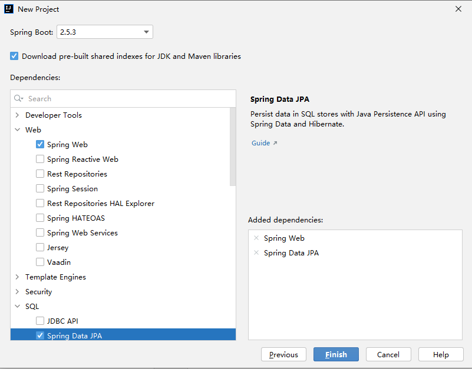

## 使用Gradle整合SpringBoot、Jetty和SQLite3。

技术积累。。。

---

### 1. 初步整合

#### 主要配置

使用`IntelliJ IDEA`创建项目

    Spring Initializr
    Type: Gradle
    Java: 8
    Packaging: Jar




配置`build.gradle`，使用`Jetty`替换`Tomcat`，使用`FreeMarker`作为模板引擎，引入`SQLite JDBC`驱动

```
// 排除Spring自带的内嵌Tomcat
configurations {
    implementation.exclude group: 'org.apache.tomcat.embed', module: 'tomcat-embed-core'
    implementation.exclude group: 'org.apache.tomcat.embed', module: 'tomcat-embed-el'
    implementation.exclude group: 'org.apache.tomcat.embed', module: 'tomcat-embed-websocket'
}

dependencies {
    implementation 'org.springframework.boot:spring-boot-starter-jetty'
    implementation 'org.springframework.boot:spring-boot-starter-freemarker'

    // 解决SQLite JDBC驱动问题
    implementation group:'org.xerial', name:'sqlite-jdbc', version:'3.34.0'
}
```

创建`SQLite`数据库文件`mydb.db`，存放于`resources/static/sqlite/`目录下，设计相关表结构并添加数据

配置`application.yml`

```
server:
  port: 8080
  servlet:
    context-path: /myapp
  jetty:
    threads:
      acceptors: 2
      selectors: 4

spring:
  freemarker:
    suffix: .ftl
    content-type: text/html
    charset: UTF-8
    cache: false
    template-loader-path: classpath:/templates
  
  mvc:
    static-path-pattern: /**

  web:
    resources:
      static-locations: classpath:/templates/,classpath:/static/

  datasource:
    driver-class-name: org.sqlite.JDBC
    url: jdbc:sqlite::resource:static/sqlite/mydb.db
    username:
    password:

  jpa:
    database-platform: com.example.sqlite.SQLiteDialect
    hibernate:
      ddl-auto: update
    show-sql: true
```

#### 项目运行

`Jetty`服务已嵌入，无需单独开启，可通过以下两种方式启动项目：

1. `IDEA`中直接运行主类

2. 使用`Gradle`的`build`命令将项目打包成`jar`文件，在终端中执行`java -jar your-file-path.jar`命令

服务启动后，浏览器访问 http://localhost:8080/myapp 即可进入主页。

---

### 2. 扩展功能

#### 拦截器实现用户登录验证

    使用session简单实现用户登录信息的存储

    通过interceptor拦截未登录请求并跳转至登录页面

#### AOP实现操作日志记录

    AOP (Aspect Oriented Programming) 使用注解方式

    获取用户IP、操作内容、操作时间等信息

#### SSE实现日志实时展示

    SSE (Server Send Event) 服务器发送事件

    将用户的操作记录到数据库，并实时展示在log页面

---

### 参考资料

* [模板开发指南 - FreeMarker 中文官方参考手册](http://freemarker.foofun.cn/dgui.html)

* [SpringBoot连接SQLite数据库](https://github.com/restart1025/Spring-Boot-SQLite)

* [SpringBoot 消息推送之 WebSocket 和 SseEmitter](https://www.jianshu.com/p/32d9989cae6f)

---

_[持续维护中。。。](https://github.com/DDDDBX/demo-spring-jetty-sqlite)_
